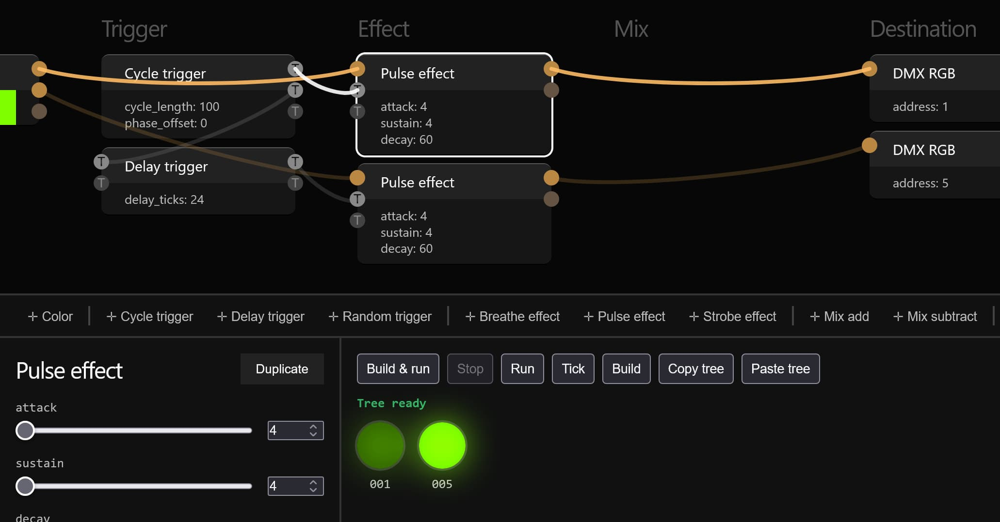

# SparkWeaver Web

Web interface to edit and simulate [SparkWeaver](https://github.com/rzuppur/sparkweaver.core) DMX lighting node setups.

# Building

### Requirements

- Linux environment, can be WSL
- Docker
- Node

### Build or Develop

1. Build webassembly by running `build.sh`. This runs the build inside an emscripten SDK Docker image and generates Wasm and a wrapper JavaScript file along with a type definition file.

2. Using npm, install dependencies and run scripts from `ui/package.json` to start or build the web UI. Wasm files need to be built first.

### Note about CMake

A partial CMakeLists.txt is provided to make CLion understand the project, run `copy_emsdk_headers.sh` to make it fully functional. It is not used for building.

# License

SparkWeaver Copyright (c) 2025 Reino Zuppur

Permission is hereby granted, free of charge, to any person obtaining a copy
of this software and associated documentation files (the "Software"), to deal
in the Software without restriction, including without limitation the rights
to use, copy, modify, merge, publish, distribute, sublicense, and/or sell
copies of the Software, and to permit persons to whom the Software is
furnished to do so, subject to the following conditions:

The above copyright notice and this permission notice shall be included in all
copies or substantial portions of the Software.

THE SOFTWARE IS PROVIDED "AS IS", WITHOUT WARRANTY OF ANY KIND, EXPRESS OR
IMPLIED, INCLUDING BUT NOT LIMITED TO THE WARRANTIES OF MERCHANTABILITY,
FITNESS FOR A PARTICULAR PURPOSE AND NONINFRINGEMENT. IN NO EVENT SHALL THE
AUTHORS OR COPYRIGHT HOLDERS BE LIABLE FOR ANY CLAIM, DAMAGES OR OTHER
LIABILITY, WHETHER IN AN ACTION OF CONTRACT, TORT OR OTHERWISE, ARISING FROM,
OUT OF OR IN CONNECTION WITH THE SOFTWARE OR THE USE OR OTHER DEALINGS IN THE
SOFTWARE.